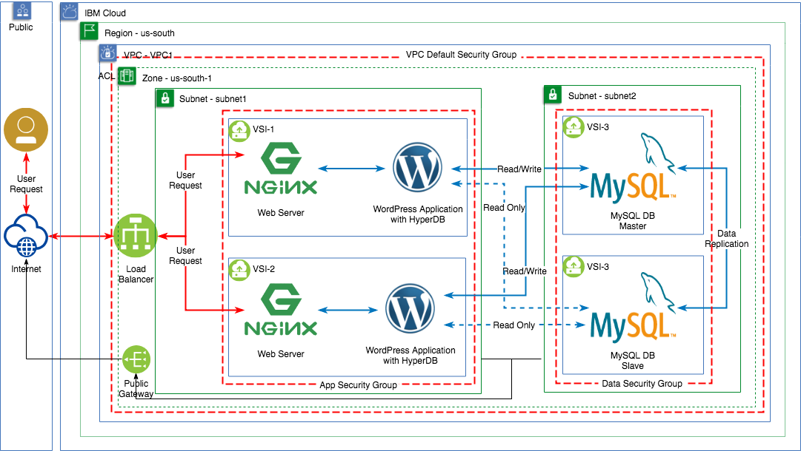

## Purpose

This section provides the steps to install and configue the application software on the VSIs created for the VPC scenario described in [*Basic 3-Tier Web App (with LB)*](../README.md).

For this use case, we will install the open source `WordPress` web site creation tool using `MySQL` database and the `HyperDB` plugin.

## VPC Data Flow Architecture



## Prerequisites

1. VPC environment created previously and ready to deploy the applications.
2. Each VSI can be accessed from the public internet using an SSH public key. Note that public access to each VSI has been done as a temporary measure to install the software.
3. Please refer to the WordPress minimum [requirements](https://wordpress.org/about/requirements/) documentation.
4. Access to the [Secure Shell (SSH)](https://www.ssh.com/ssh/) Command.
5. Basic understanding of installation of packages on Linux and SQL database commands.

## Activities executed to setup the Application layer on the VPC environment

1. Install and test MySQL on `MySQL1` and `MySQL2`.
2. Install and test PHP and Nginx on `AppServ1` and `AppServ2`.
3. Install and test WordPress on `AppServ1`.
4. Test WordPress on `AppServ1`.
5. Install and test database replication from `MySQL1` (master) to `MySQL2` (slave).
6. Install and test HyperDB on `AppServ1`.
7. Install and test WordPress on `AppServ2`.
8. Test Load Balancer.

## Install MySQL - MySQL1

First, we will setup the database environment for WordPress. We will install MySQL on each of the database servers and create a WordPress database.

Connect to the `MySQL1` server using SSH and the reserved floating IP address.
```
ssh root@169.61.244.78
```
### Update the Linux environment

Bring the environment up to date. Refer to [Using apt-get Commands In Linux](https://itsfoss.com/apt-get-linux-guide/) for more information on `apt-get`.
```
apt-get update
apt-get upgrade
```
### Install MySQL Package

Next install MySQL. Refer to [MySQL](https://www.mysql.com/) for more information.
```
apt-get -y install mysql-server
```
**Note**: If the installation encounters a `groot` error, please follow the instructions in the following link: [Error: groot must be grub root device on ubuntu](https://developer.ibm.com/answers/questions/462237/error-groot-must-be-grub-root-device-on-ubuntu/)

### Enhance Security of MySQL installation

MySQL server package comes with a script called `mysql_secure_installation` that can perform several security-related operations. Run the following command to set the database password and allow `root` user to connect from a remote server. For more information refer to [Improve MySQL Installation Security](https://dev.mysql.com/doc/refman/5.7/en/mysql-secure-installation.html)
```
mysql_secure_installation
```
Responses for this installation:

- Respond `n` when prompted to setup *VALIDATE PASSWORD PLUGIN* and set a new password.
- Enter `mysqlpass` as the MySQL password.
- Respond `y` to remove anonymous users.
- Respind `n` to disallow root login remotely.
- Respond `y` to remove test database.
- Respond `y` to reload privilege tables.

Result:
```
Securing the MySQL server deployment.

Connecting to MySQL using a blank password.

VALIDATE PASSWORD PLUGIN can be used to test passwords
and improve security. It checks the strength of password
and allows the users to set only those passwords which are
secure enough. Would you like to setup VALIDATE PASSWORD plugin?

Press y|Y for Yes, any other key for No: n
Please set the password for root here.

New password:

Re-enter new password:
By default, a MySQL installation has an anonymous user,
allowing anyone to log into MySQL without having to have
a user account created for them. This is intended only for
testing, and to make the installation go a bit smoother.
You should remove them before moving into a production
environment.

Remove anonymous users? (Press y|Y for Yes, any other key for No) : y
Success.


Normally, root should only be allowed to connect from
'localhost'. This ensures that someone cannot guess at
the root password from the network.

Disallow root login remotely? (Press y|Y for Yes, any other key for No) : n

 ... skipping.
By default, MySQL comes with a database named 'test' that
anyone can access. This is also intended only for testing,
and should be removed before moving into a production
environment.


Remove test database and access to it? (Press y|Y for Yes, any other key for No) : y
 - Dropping test database...
Success.

 - Removing privileges on test database...
Success.

Reloading the privilege tables will ensure that all changes
made so far will take effect immediately.

Reload privilege tables now? (Press y|Y for Yes, any other key for No) : y
Success.

All done!
```

### Create application database

Now we will create a database for the `WordPress` application.

**Login to MySQL**
```
mysql -u root -p
```
Result
```
Enter password:
Welcome to the MySQL monitor.  Commands end with ; or \g.
Your MySQL connection id is 4
Server version: 5.7.25-0ubuntu0.18.04.2 (Ubuntu)

Copyright (c) 2000, 2019, Oracle and/or its affiliates. All rights reserved.

Oracle is a registered trademark of Oracle Corporation and/or its
affiliates. Other names may be trademarks of their respective
owners.

Type 'help;' or '\h' for help. Type '\c' to clear the current input statement.

mysql>
```

**Create the `wordpress` database**
```
CREATE DATABASE wordpress;
```
Result
```
Query OK, 1 row affected (0.01 sec)
```
**Grant privileges to `root` user.**
See [GRANT Syntax](https://dev.mysql.com/doc/refman/8.0/en/grant.html).
```
GRANT SELECT,INSERT,UPDATE,DELETE,CREATE,DROP,ALTER ON wordpress.* TO root@'%' IDENTIFIED BY 'mysqlpass';
```
Result
```
Query OK, 0 rows affected, 1 warning (0.00 sec)
```
**Reload grant tables.**
```
FLUSH PRIVILEGES;
```
Result
```
Query OK, 0 rows affected (0.00 sec)
```
**List available databases**
```
show databases;
```
Result
```
+--------------------+
| Database           |
+--------------------+
| information_schema |
| mysql              |
| performance_schema |
| sys                |
| wordpress          |
+--------------------+
5 rows in set (0.00 sec)
```
**Leave MySQL**
```
exit
```
Result
```
Bye
```
 **Note:** At any time in the WordPress installation process you can repeat creating the WordPress database by deleting the database (use `DROP DATABASE wordpress;`) and repeating the above steps to create it again.

### Make MySQL server visible on the network

Edit `/etc/mysql/my.cnf` and add these lines:
```
[mysqld]
bind-address    = 0.0.0.0
```
**Restart MySQL**
```
systemctl restart mysql
```
**Validate MySQL is ready**

Confirm MySQL is listening on all interfaces by running the following command.
```
netstat --listen --numeric-ports | grep 3306
```
Result:
```
tcp        0      0 0.0.0.0:3306            0.0.0.0:*               LISTEN
```
**Leave `MySQL1` server**

Logoff from the VSI using the `exit` command.

## Install MySQL - MySQL2

Connect to the `MySQL2` server using SSH and the reserved floating IP address.
```
ssh root@169.61.244.62
```
Repeat the MySQL install for `MySQL2` following the steps for `MySQL1`.

## Install Nginx - AppServ1

Before installing WordPress, a web server and PHP runtime needs to be configured. Here we will use two SSH terminal sessions to connect to each application server separately.

Connect to the `AppServ1` server using SSH and the reserved floating IP address.
```
ssh root@169.61.244.83
```
### Update the Linux environment

Bring the environment up to date. Refer to [Using apt-get Commands In Linux](https://itsfoss.com/apt-get-linux-guide/) for more information on `apt-get`.
```
apt-get update
apt-get upgrade
```
### Install Nginx web server.

Install [Nginx](https://www.nginx.com/).
```
apt-get -y install nginx
```
**Note**: If the installation encounters a `groot` error, please follow the instructions in the following link: [Error: groot must be grub root device on ubuntu](https://developer.ibm.com/answers/questions/462237/error-groot-must-be-grub-root-device-on-ubuntu/)

At this point Nginx has been installed and it is up and running. You can validate its installation by entering the floating IP of `AppServ1` on a web browser (you should get the following message: "Welcome to nginx!").

## Install Nginx - AppServ2

Connect to the `AppServ2` server using SSH and the reserved floating IP address.
```
$ ssh root@169.61.244.70
```
Repeat the Nginx install for `AppServ2` following the steps for `AppServ1`.

### Test the Load Balancer.

Once the installation of Nginx is complete, the Load Balancer health checks should pass and the application severs should be accessible through the load balancer. Use the public address (hostname) of the Load Balancer to access the Nginx page (you should get the following message: "Welcome to nginx!")

In our case --> `http://8d3374f1.lb.appdomain.cloud/`

Note: Load Balancer health checks execute an HTTP GET on port 80 and expects an HTTP 200 returned. You can also test the HTTP return by executing the following cURL command on any of the servers: `curl -v http://<private_ip>:80/` where <private_ip> is the IP of the target host.

For example,
```
curl -v http://10.10.11.6:80/
```
Result
```
Connected to 10.10.11.6 (10.10.11.6) port 80 (#0)
> GET / HTTP/1.1
> Host: 10.10.11.6
> User-Agent: curl/7.58.0
> Accept: */*
>
< HTTP/1.1 200 OK
< Server: nginx/1.14.0 (Ubuntu)
< Date: Wed, 10 Apr 2019 04:46:41 GMT
< Content-Type: text/html
< Content-Length: 612
< Last-Modified: Wed, 10 Apr 2019 04:27:45 GMT
< Connection: keep-alive
< ETag: "5cad70c1-264"
< Accept-Ranges: bytes
```

## Install PHP - AppServ1

In this activity we will install [PHP-FPM](https://php-fpm.org/) and the [MySQL plugin](https://www.php.net/manual/en/set.mysqlinfo.php). (PHP-FPM is required for Nginx web server).

PHP will start automatically after installation.
```
apt-get -y install php-fpm php-mysql
```

**Confiure PHP**

Nginx installation includes a default configuration file. We need to modify this file to enable PHP but let's first create a backup copy of this file in case we need to restore the default configuration.
```
cp /etc/nginx/sites-available/default /etc/nginx/sites-available/default_original
```

Edi the configuration file `/etc/nginx/sites-available/default` and following these steps:
1. Remove/Comment `default_server` from listening port.
```
listen 80; # default_server;
listen [::]:80; # default_server;
```
2. Add `index.php` to the beginning of directive `index`.
```
index index.php index.html index.htm index.nginx-debian.html;
```
- Uncomment lines for `location ~ \.php$` and update PHP version to the one just installed. In this case, `7.2`.
```
location ~ \.php$ {
        include snippets/fastcgi-php.conf;
#
#       # With php-fpm (or other unix sockets):
        fastcgi_pass unix:/var/run/php/php7.2-fpm.sock;
#       # With php-cgi (or other tcp sockets):
#       fastcgi_pass 127.0.0.1:9000;
}
```
- Uncomment lines for `location ~ /\.ht`
```
location ~ /\.ht {
        deny all;
}
```
Notes on contents of Nginx configuration file:
- `listen` — Defines what port Nginx will listen on. In this case, it will listen on port 80, the default port for HTTP.
- `root` — Defines the document root where the files served by the website are stored.
- `index` — Configures Nginx to prioritize serving files named index.php when an index file is requested, if they’re available.
- `location /` — The first location block includes a try_files directive, which checks for the existence of files matching a URI request. If Nginx cannot find the appropriate file, it will return a 404 error.
- `location ~ \.php$` — This location block handles the actual PHP processing by pointing Nginx to the fastcgi-php.conf configuration file and the php7.2-fpm.sock file, which declares what socket is associated with php-fpm.
`location ~ /\.ht` — The last location block deals with .htaccess files, which Nginx does not process. By adding the deny all directive, if any .htaccess files happen to find their way into the document root they will not be served to visitors.

Test your new configuration file for syntax errors by typing:
```
sudo nginx -t
```
**Create a PHP file to test configuration**

The default Nginx configuration file defines `root` as `/var/www/html/`. Create file `/var/www/html/info.php` at this location with the following entries:
```
<?php
phpinfo();
```
**Test PHP**

Restart Nginx
```
systemctl reload nginx
```
Load `info.php` in your browser using `AppServ1` public IP address.
```
http://169.61.244.83/info.php
```
You should get a dump of `AppServ1` information generated by PHP.

## Install PHP - AppServ2

Connect to the `AppServ2` server using SSH and the reserved floating IP address.
```
$ ssh root@169.61.244.70
```
Repeat the PHP install for `AppServ2` following the steps for `AppServ1`.

## Test the Load Balancer.

You can now test your Load Balancer and validate that both application servers are getting called.

In our case --> `http://8d3374f1.lb.appdomain.cloud/info.php`

By reloading the web browser a few times, the PHP information will flip-flop from `AppServ1` to `AppServ2`.

## Installing WordPress

Up to this point, we have done the same activities in both `AppServ1` and `AppServ2`. From this point forwards, all activities will be executed only on `AppServ1` unless noted otherwise.

### Stop PHP and Nginx in both AppServ1 and AppServ2.

We will shutdown both servers for the next steps. Use the following on both `AppServ1` and `AppServ2`.
```
systemctl stop php7.2-fpm
systemctl stop nginx
```

__NOTE:__ *************************************************************************************

**NOTE:** STOP `AppServ2` and hold activities until section [Add AppServ2 to the WordPress environment](https://github.ibm.com/customer-success/ibmcloud/blob/master/VPC_Phase1/VPC_Scenarios/vpc1/WebApp.md#add-appserv2-to-the-wordpress-environment)

__NOTE:__ *************************************************************************************

### Install WordPress - AppServ1

**Add additional PHP extensions**

Up to now, we only required a very minimal set of extensions in order to get PHP to communicate with MySQL. WordPress and many of its plugins leverage additional PHP extensions. Install these.
```
apt install php-curl php-gd php-intl php-mbstring php-soap php-xml php-xmlrpc php-zip
```
**Retrieve Wordpress installation files**

Change to `/tmp` folder.
```
cd /tmp
```
Get latest tar file
```
curl -O https://wordpress.org/latest.tar.gz
```
Result
```
  % Total    % Received % Xferd  Average Speed   Time    Time     Time  Current
                                 Dload  Upload   Total   Spent    Left  Speed
100 10.1M  100 10.1M    0     0  14.6M      0 --:--:-- --:--:-- --:--:-- 14.6M
```
Uncompress file
```
tar xzvf latest.tar.gz
```
**Prepare the Wordpress files for installation**

Use the default configuration file.
```
cp /tmp/wordpress/wp-config-sample.php /tmp/wordpress/wp-config.php
```
Create an upgrade folder.
```
mkdir /tmp/wordpress/wp-content/upgrade
```
We will use `/var/www/wordpress` as the root directory of our WordPress install.
```
mkdir /var/www/wordpress
```
Transfer files to `/var/www/wordpress` location
```
rsync -av -P /tmp/wordpress/. /var/www/wordpress
```
Set file access permissions.
```
chown -R www-data:www-data /var/www/wordpress
find /var/www/wordpress -type d -exec chmod g+s {} \;
chmod g+w /var/www/wordpress/wp-content
chmod -R g+w /var/www/wordpress/wp-content/themes
chmod -R g+w /var/www/wordpress/wp-content/plugins
```
### Configure WordPress

Edit file `/var/www/wordpress/wp-config.php` and set the DB information for `MySQL1` (use port 3306 on DB_HOST).
```
define('DB_NAME', 'wordpress');
define('DB_USER', 'root');
define('DB_PASSWORD', 'mysqlpass');
define('DB_HOST', '10.10.12.7:3306');
```
Call the following web service to get the WordPress security keys. Use the result to update the corresponding entries in file `/var/www/wordpress/wp-config.php`.
```
curl -s https://api.wordpress.org/secret-key/1.1/salt/
```
Result - **DO NOT COPY THESE - Use the keys generated in the previous command for your setup**
```
define('AUTH_KEY',         'cH$fF-|t$fMHlX#kf,{a+w|Z=efedUGv{2&V#@e `0-@S_(I`jV4EV=tKQsk]Dbe');
define('SECURE_AUTH_KEY',  'LocO1 dNUYQaK::E+Dve|At1)h|U||E>nH4tyA+Qq@X{Ed3t[DTqpj#x_^*#0&MA');
define('LOGGED_IN_KEY',    'XE,|u,JEDMbasQ~ chXzV;Q!L-Pj0tHf}Xt^PY&Y`}TgUuRlI[#:?+}z*iAk5x,U');
define('NONCE_KEY',        'jq(6T?%T~*~nv?+%vcPBPYPoLu,vHBF>|D!^73QsL`-nTvP(qZY1WEAf<T=t-l;)');
define('AUTH_SALT',        '?C?lO.K,/46|(FQby=;/J#NX[uAg{b#FT&&e>>s6$iA{m@X9@!68016to&>-+Eyt');
define('SECURE_AUTH_SALT', 'HSu#sJcP`3BOu33d*tL>sxLCJ`RSe_M2O%qjWw Yq#30_m/Et-Ns3Zh-iPbID&LG');
define('LOGGED_IN_SALT',   '~0$^]Z;,/X?F[+c6=4(xGcG+@YI}<9&1~?B&GlTFg+({#|b:|v1|QhHRmWlk(2G5');
define('NONCE_SALT',       ' wu^]-@w>oq){N%DPZM)P=]w|Vp scl9kzhRebDqHheJMSfhm)vG/DAl)o|fOTgg');
```
**NOTE**: The same WP security keys must be used in `AppServ1` and `AppServ2` (or all App servers in a cluster).

### Configure Nginx for WordPress

We need to modify the Nginx configuration file for WordPress. (see [WordPress rules](https://codex.wordpress.org/Nginx)).

Before the update, let's backup the current file setup for PHP.
```
cp /etc/nginx/sites-available/default /etc/nginx/sites-available/default_PHP
```
Edit Nginx configuration file `/etc/nginx/sites-available/default` and add the following locations within the main `server` block:
```
        location = /favicon.ico {
                 log_not_found off;
                 access_log off;
                 expires max;
         }

        location = /robots.txt {
                allow all;
                log_not_found off;
                access_log off;
        }

        location ~* \.(js|css|png|jpg|jpeg|gif|ico)$ {
                expires max;
                log_not_found off;
        }
```
Inside of the existing `location /` block, we need to adjust the try_files list so that instead of returning a 404 error by default, control is passed to the index.php file with the request arguments. This should look something like this:
```
        location / {
                # First attempt to serve request as file, then
                # as directory, then fall back to displaying a 404.
                #try_files $uri $uri/ =404;

                # This is cool because no php is touched for static content.
                # include the "$is_args$args" so non-default permalinks doesn't break when using query string
                try_files $uri $uri/ /index.php$is_args$args;
        }
```
Finally, update `root` to point to the WordPress location.
```
        #root /var/www/html;
        root /var/www/wordpress;
```
The configuration is now complete. Save the Nginx file and check it for errors using this command:
```
sudo nginx -t
```

**AppServ2** Skip to [Configure HyperDB](WebApp.md#configure-hyperdb)

**Start the web server and the PHP runtime.**
```
systemctl start php7.2-fpm
systemctl start nginx
```
### Complete WordPress installation through the Web UI

**Notes:**
1. WordPress `readme` file can be accessed using the following link `http://<floatingip>/readme.html`.
2. The Load Balancer health checks will fail until the WordPress setup is complete.

Continue WordPress installation as follows:
- On your Web Browser, access the Wordpress installation using `AppServ1` floating IP `http://169.61.244.83`.
- This will take you to `http://169.61.244.83/wp-admin/install.php`.
- Select `Install WordPress` and provide the required fields to complete the installation.
```
Site Title = Basic 3-Tier Web App
User Name = wpadmin
Password = mywppass
Your Email = <your email>
```
**Update WordPress URLs**

1. Login to Wordpress administrator web page `http://169.61.244.83/wp-admin` using the administrator ID and password.
2. Select `Settings` on the dashboard to get to the `General Settings` view.
3. Set the `WordPress Address (URL)` and `Site Address (URL)` to the Load Balancer public address (**do not** include a slash character at the end). In our case the entries will be:
```
WordPress Address (URL) = http://8d3374f1.lb.appdomain.cloud
Site Address (URL) = http://8d3374f1.lb.appdomain.cloud
```
4. Save your changes.
5. Stop PHP and Nginx
```
systemctl stop php7.2-fpm
systemctl stop nginx
```
6. Edit file `/var/www/wordpress/wp-config.php` and add the following two entries at the end of the file:
```
/* Override WP Admin console settings for Site and Home URLs */
define( 'WP_SITEURL', 'http://8d3374f1.lb.appdomain.cloud' );
define( 'WP_HOME', 'http://8d3374f1.lb.appdomain.cloud' );
```
7. Start PHP and Nginx
```
systemctl start php7.2-fpm
systemctl start nginx
```
The WordPress installation is now complete and your Load Balancer health check will now be OK for `AppServ1`. On a browser window enter the Load Balancer public address to validate.

**Note**: If needed, you can reset the WordPress Web UI installation by deleting and recreating the `wordpress` database as noted in the `MySQL1` server setup section. Then repeat the steps above.

### Add WordPress Incorrect Datetime Bug Fix

`HyperDB` introduces a date/time issue in MySQL and we need to install WordPress plugin `Incorrect Datetime Bug Fix` to fix this issue.
1. Login to Wordpress administrator web page `http://8d3374f1.lb.appdomain.cloud/wp-admin` using the administrator ID and password.
2. Select `Plugins` on the dashboard and then `Add New` to get to the WordPress Plugins page.
3. Search for "Incorrect Datetime" to find the plugin.
4. Select `Install Now` and `Activate`.

### Test WordPress functions
1. Login to Wordpress administrator web page `http://http://8d3374f1.lb.appdomain.cloud/wp-admin` using the administrator ID and password.
2. On the dashboard, add a new post: `Posts` > `Add New` and enter any data you wish. `Publish` your post.
3. Confirm your post appears on the WordPress web page. Use another browser window and enter the Load Balancer public address. **Note**: Using the `AppServ1` floating IP (`http://169.61.244.83`) will be redirected to the Load Balancer address.
4. On the WordPress web page, enter a comment/reply to the post just published.
5. Back on the WordPress administrator dashboard, select `Comments` to display the new comment waiting for approval. Approve it.
6. On the dashboard, select `Appearance` > `Themes` > select theme `Twenty Seventeen` > `Live preview`.
7. `Activate and Publish` the new theme.
8. Validate theme update on separate browser window.

## HA Configuration

In this section we will use [MySQL database replication](https://dev.mysql.com/doc/refman/5.7/en/replication.html) and the [HyperDB](https://wordpress.org/plugins/hyperdb/) plugin to enable scalability of the solution.

## MySQL Database Replication.

MySQL replication enables data from one MySQL database server (the master) to be copied automatically to one or more MySQL database servers (the slaves). Replication is usually used to spread read access on multiple servers for scalability. In addition, since the data is replicated to multiple databases, these can work as backups or failovers when the master is not available.

Replication is asynchronous by default; slaves do not need to be connected permanently to receive updates from the master. Depending on the configuration, you can replicate all databases, selected databases, or even selected tables within a database.

In our scenario, we will configure `MySQL2` as a replica (**slave**) of `MySQL1` (**master**) to enable a scalability of the solution.

### Configure MySQL1 - Master

Connect to the MySQL1 server using the reserved floating ip address.
```
$ ssh root@169.61.244.78
```

Edit the MySQL configuration file `/etc/mysql/my.cnf` and add the following to the `[mysqld]` group to configure it as the the master database.
```
server-id       = 1
log_bin         = /var/log/mysql/mysql-bin.log
binlog_do_db    = wordpress
```
- `server-id` - With MySQL master-slave replication each instance must have its own unique server-id, use 1 for the master.
- `log_bin` - Name and location of the binary log file. This log is used by the slave nodes to replicate registered database changes.
- `binlog_do_db` - Database to be replicated. In out case, `wordpress`.

Restart MySQL.
```
systemctl restart mysql
```

Prepare master database.  This will require two seperate ssh sessions to `MySQL1`.  On the first ssh session
configure the MySQL master.

Login to MySQL
```
mysql -u root -p
```
We need to grant privileges to the slave. The following command will set the slave's user name and password:

   - GRANT REPLICATION SLAVE ON *.* TO `'slave_user'`@'%' IDENTIFIED BY `'password'`;

In our case, `slave_user` will be `root` and `password` will be `mysqlpass`.
```
GRANT REPLICATION SLAVE ON *.* TO 'root'@'%' IDENTIFIED BY 'mysqlpass';
```
Result
```
Query OK, 0 rows affected, 1 warning (0.01 sec)
```
Reload grant tables.
```
FLUSH PRIVILEGES;
```
Result
```
Query OK, 0 rows affected (0.01 sec)
```
Access `wordpress` database.
```
USE wordpress;
```
Result
```
Reading table information for completion of table and column names
You can turn off this feature to get a quicker startup with -A

Database changed
```
Lock database to prevent changes.
```
FLUSH TABLES WITH READ LOCK;
```
Result
```
Query OK, 0 rows affected (0.00 sec)
```
Show status
```
SHOW MASTER STATUS;
```
You will see something like this:
```
+------------------+----------+--------------+------------------+-------------------+
| File             | Position | Binlog_Do_DB | Binlog_Ignore_DB | Executed_Gtid_Set |
+------------------+----------+--------------+------------------+-------------------+
| mysql-bin.000003 |     6941 | wordpress    |                  |                   |
+------------------+----------+--------------+------------------+-------------------+
1 row in set (0.00 sec)
```
This is the `position` from which the slave database will start replicating. Record both the `file` name and the `position`. These will be needed later when configuring the `slave` node.

**Note:** If you make any new changes in the current SSH window, the database will automatically unlock. For this reason, you should open a new ssh session to MySQL1 and continue with the next steps there.

**On the second SSH window**,

**Note**: Database dump is not necessary if starting with an empty database (no tables, no data). Skip to unlock the tables.

Enter the following at the bash command line (not in mysql command line). This will generate a database dump of `wordpress` in the current directory (`wordpress.sql`).
```
mysqldump -u root -p --opt wordpress > wordpress.sql
```

Now, back to your original SSH session and unlock the database (making them writeable again).
```
UNLOCK TABLES;
```
Result
```
Query OK, 0 rows affected (0.00 sec)
```
Exit `mysql` shell command.
```
QUIT;
```
Result
```
Bye
```

At this time the configuration of the `master` database is completed.

### Configure MySQL2 - Slave

We need to get `wordpress.sql` from `MySQL1` to `MySQL2`. To achieve this, we will need to pull the file from `MySQL1` to your local system and then push it to `MySQL2`.

From your local system, pull the file from `MySQL1`.
```
scp root@169.61.244.78:wordpress.sql .
```
Result
```
wordpress.sql                                 100%   93KB 591.1KB/s   00:00
```
Now push it to `MySQL2`.
```
scp wordpress.sql root@169.61.244.62:wordpress.sql
```
Result
```
wordpress.sql                                 100%   93KB 425.4KB/s   00:00
```

Connect to the `MySQL2` server using the reserved floating ip address.
```
$ ssh root@169.61.244.62
```
Import the database that you previously exported from the `master` database (`MySQL1`).
```
mysql -u root -p wordpress < wordpress.sql
```
You can now validate that the database has been imported by logging into MySQL and list the tables in the `wordpress` database.
Login to MySQL
```
mysql -u root -p
```
Access `wordpress`
```
USE wordpress;
```
Result
```
Reading table information for completion of table and column names
You can turn off this feature to get a quicker startup with -A

Database changed
```
List the database tables
```
SHOW TABLES;
```
Result
```
+-----------------------+
| Tables_in_wordpress   |
+-----------------------+
| wp_commentmeta        |
| wp_comments           |
| wp_links              |
| wp_options            |
| wp_postmeta           |
| wp_posts              |
| wp_term_relationships |
| wp_term_taxonomy      |
| wp_termmeta           |
| wp_terms              |
| wp_usermeta           |
| wp_users              |
+-----------------------+
12 rows in set (0.00 sec)
```
Exit MySQL.
```
quit;
```
Now we need to configure the `slave` configuration in the same way as we did with the master. Edit file `/etc/mysql/my.cnf` and append the following lines to `[mysqld]` block.
```
server-id       = 2
relay-log       = /var/log/mysql/mysql-relay-bin.log
log_bin         = /var/log/mysql/mysql-bin.log
binlog_do_db    = wordpress
```
The new entry, `relay-log`, is a set of log files created by a slave during replication. It's the same format as the binary log, containing a record of events that affect the data or structure; thus, mysqlbinlog can be used to display its contents.

Restart MySQL.
```
systemctl restart mysql
```

The next step is to enable the replication from within the MySQL shell. Login to MySQL.
```
mysql -u root -p
```

The following command will be used to link to the `master` node (MySQL1).

   - CHANGE MASTER TO MASTER_HOST=`'<master_ip>'`,MASTER_USER=`'<slave_user>'`, MASTER_PASSWORD=`'<password>'`, MASTER_LOG_FILE=`'<master_log>'`, MASTER_LOG_POS=`<master_log_position>`;

Set `MASTER_LOG_FILE` and `MASTER_LOG_POS` to values previously saved when `SHOW MASTER STATUS` was executed on the master (`mysql-bin.000003` and `6941`). `MASTER_HOST` will be the IP address for MySQL1.

In this example, the values used are:
```
MASTER_HOST     = '10.10.12.7'
MASTER_USER     = 'root'
MASTER_PASSWORD = 'mysqlpass'
MASTER_LOG_FILE = 'mysql-bin.000003'
MASTER_LOG_POS  = 6941;
```
Change to `master`
```
CHANGE MASTER TO MASTER_HOST='10.10.12.7',MASTER_USER='root', MASTER_PASSWORD='mysqlpass',MASTER_LOG_FILE='mysql-bin.000001', MASTER_LOG_POS=6941;
```
Result
```
Query OK, 0 rows affected, 2 warnings (0.02 sec)
```
Start the `slave`
```
START SLAVE;
```
Result
```
Query OK, 0 rows affected (0.00 sec)
```
Show the the details of the slave replication by typing the following command. (The \G rearranges the text to make it more readable).

Confirm replication is active with rows `Slave_IO_Running` and `Slave_SQL_Running` set to `yes`. Also the `Read_Master_Log_Pos` will be set to the current index in the `master` (use SHOW MASTER STATUS; on MySQL1 to see current value).
```
SHOW SLAVE STATUS\G
```
Result
```
*************************** 1. row ***************************
               Slave_IO_State: Waiting for master to send event
                  Master_Host: 10.10.12.7
                  Master_User: root
                  Master_Port: 3306
                Connect_Retry: 60
              Master_Log_File: mysql-bin.000003
          Read_Master_Log_Pos: 6941
               Relay_Log_File: mysql-relay-bin.000002
                Relay_Log_Pos: 320
        Relay_Master_Log_File: mysql-bin.000003
             Slave_IO_Running: Yes
            Slave_SQL_Running: Yes
              Replicate_Do_DB:
          Replicate_Ignore_DB:
           Replicate_Do_Table:
       Replicate_Ignore_Table:
      Replicate_Wild_Do_Table:
  Replicate_Wild_Ignore_Table:
                   Last_Errno: 0
                   Last_Error:
                 Skip_Counter: 0
          Exec_Master_Log_Pos: 6941
              Relay_Log_Space: 527
              Until_Condition: None
               Until_Log_File:
                Until_Log_Pos: 0
           Master_SSL_Allowed: No
           Master_SSL_CA_File:
           Master_SSL_CA_Path:
              Master_SSL_Cert:
            Master_SSL_Cipher:
               Master_SSL_Key:
        Seconds_Behind_Master: 0
Master_SSL_Verify_Server_Cert: No
                Last_IO_Errno: 0
                Last_IO_Error:
               Last_SQL_Errno: 0
               Last_SQL_Error:
  Replicate_Ignore_Server_Ids:
             Master_Server_Id: 1
                  Master_UUID: c33c0fc3-1f12-11e9-9cd7-061952205e31
             Master_Info_File: /var/lib/mysql/master.info
                    SQL_Delay: 0
          SQL_Remaining_Delay: NULL
      Slave_SQL_Running_State: Slave has read all relay log; waiting for more updates
           Master_Retry_Count: 86400
                  Master_Bind:
      Last_IO_Error_Timestamp:
     Last_SQL_Error_Timestamp:
               Master_SSL_Crl:
           Master_SSL_Crlpath:
           Retrieved_Gtid_Set:
            Executed_Gtid_Set:
                Auto_Position: 0
         Replicate_Rewrite_DB:
                 Channel_Name:
           Master_TLS_Version:
1 row in set (0.00 sec)
```

At this point, configuration for MySQL database replication is complete.

**NOTE:**

### Test data replication on slave - MySQL2

Still at the `mysql>` prompt, we will execute a series of SQL queries.

1. Access `wordpress` database.
```
USE wordpress;
```
2. Execute the following MySQL query to get the number of entries in table `wp_posts`.
```
select count(*) from wp_posts;
```
Result
```
mysql> select count(*) from wp_posts;
+----------+
| count(*) |
+----------+
|        9 |
+----------+
1 row in set (0.01 sec)
```
3. Execute the following MySQL query to get the number of entries in table `wp_comments`.
```
select count(*) from wp_comments;
```
Result
```
mysql> select count(*) from wp_comments;
+----------+
| count(*) |
+----------+
|        4 |
+----------+
1 row in set (0.00 sec)
```
4. Go to WordPress and add a new post and message.
5. Repeat the above queries to validate the quantities increased.

## Configure HyperDB

The `HyperDB` plugin replaces the standard `wpdb` class so that WordPress is able to write and read from additional database servers. The drop-in plugin supports database replication, failover, load balancing, and partitioning — all tools for scaling WordPress.

We will use HyperDB to determine where to send updates (the `master` database) and read requests (both `master` and `slave`).

### Install HyperDB Plugin - AppServ1

Connect to the `AppServ1` server using the reserved floating ip address.
```
ssh root@169.61.244.83
```
**Stop PHP and Nginx**
```
systemctl stop php7.2-fpm
systemctl stop nginx
```

**Download HyperDB**
Download `HyperDB` zip file from WordPress to the home directory of `AppServ1`.
```
cd ~
wget https://downloads.wordpress.org/plugin/hyperdb.1.5.zip
```
Result
```
--2019-04-08 04:10:12--  https://downloads.wordpress.org/plugin/hyperdb.1.5.zip
Resolving downloads.wordpress.org (downloads.wordpress.org)... 198.143.164.250
Connecting to downloads.wordpress.org (downloads.wordpress.org)|198.143.164.250|:443... connected.
HTTP request sent, awaiting response... 200 OK
Length: 19958 (19K) [application/octet-stream]
Saving to: ‘hyperdb.1.5.zip’

hyperdb.1.5.zip                100%[===================================================>]  19.49K  --.-KB/s    in 0.04s

2019-04-08 04:10:12 (513 KB/s) - ‘hyperdb.1.5.zip’ saved [19958/19958]
```
**Install zip/unzip**
```
apt-get -y install unzip
```
If you get a `groot` error, edit the file `/boot/grub/menu.lst` and change the value to `(hd0)`.

Result
```
Reading package lists... Done
Building dependency tree
Reading state information... Done
Suggested packages:
  zip
The following NEW packages will be installed:
  unzip
0 upgraded, 1 newly installed, 0 to remove and 116 not upgraded.
Need to get 167 kB of archives.
After this operation, 558 kB of additional disk space will be used.
Get:1 http://mirrors.adn.networklayer.com/ubuntu bionic/main amd64 unzip amd64 6.0-21ubuntu1 [167 kB]
Fetched 167 kB in 0s (456 kB/s)
Selecting previously unselected package unzip.
(Reading database ... 121369 files and directories currently installed.)
Preparing to unpack .../unzip_6.0-21ubuntu1_amd64.deb ...
Unpacking unzip (6.0-21ubuntu1) ...
Processing triggers for mime-support (3.60ubuntu1) ...
Setting up unzip (6.0-21ubuntu1) ...
Processing triggers for man-db (2.8.3-2) ...
```
**Unarchive `HyperDB`**
```
unzip hyperdb.1.5.zip
```
Result
```
Archive:  hyperdb.1.5.zip
   creating: hyperdb/
  inflating: hyperdb/db-config.php
  inflating: hyperdb/db.php
  inflating: hyperdb/readme.txt
```
**Configure `HyperDB`**

Copy the sample `HyperDB` configuration file `db-config.php` to the WordPress installation folder. HyperDB uses this file to specify several servers. One as the `master` server for write queries and several `slaves` for read queries.
```
cp ~/hyperdb/db-config.php /var/www/wordpress/db-config.php
```
Edit the `HyperDB` config file in `/var/www/wordpress/db-config.php` and locate the entries with `$wpdb->add_database(array(`. For example,
```
$wpdb->add_database(array(
        'host'     => DB_HOST,     // If port is other than 3306, use host:port.
        'user'     => DB_USER,
        'password' => DB_PASSWORD,
        'name'     => DB_NAME,
));
```
The first `add_database` entry is for the `master` database server (`MySQL1`) and the second entry defines the `slave` database server (`MySQL2`) (the slave entry can be identified by `write' => 0`).

The values for `DB_HOST`, `DB_USER`, etc. have already been defined in the WordPress configuration file (`wp-config.php`). Also, both `master` and `slave` use the same credentials. The only value we need to update in `db-config.php` is to change the host variable on the second entry to `SLAVE_DB_HOST`.
```
$wpdb->add_database(array(
        'host'     => SLAVE_DB_HOST,     // If port is other than 3306, use host:port.
        'user'     => DB_USER,
        'password' => DB_PASSWORD,
        'name'     => DB_NAME,
        'write'    => 0,
        'read'     => 1,
        'dataset'  => 'global',
        'timeout'  => 0.2,
));
```
Note that because this is defined as an array, you can copy this bit of code for as many database `slaves` as you’d like to setup.

Save your changes.

**Configure WordPress**

Edit file `/var/www/wordpress/wp-config.php` and the following entry to define `MySQL2` as the `slave` host.
```
/** MySQL slave hostname */
define( 'SLAVE_DB_HOST', '10.10.12.5:3306' );
```

Save your changes.

**Enable `HyperDB`**

Copy the unzipped `HyperDB` plugin to `/var/www/wordpress/wp-content/`.
- Installing this file on this directory will enable `HyperDB`.
- Removing the file will disable `HyperDB`.
```
cp ~/hyperdb/db.php /var/www/wordpress/wp-content/
```
**Start PHP and Nginx**

Restart the web application to pick up the new configuration.
```
systemctl start php7.2-fpm
systemctl start nginx
```

### AppServ2 only
1. Bring down PHP and Nginx in `AppServ1`
```
systemctl stop php7.2-fpm
systemctl stop nginx
```
2. Access WordPress on `AppServ2`.
3. Install WordPress plugin `Incorrect Datetime Bug Fix`.

### Test HyperDB

Now that the setup is complete, let's test both MySQL replication and HyperDB.

**Test HyperDB**
1. Bring down the `master` database - `MySQL1`.
```
service mysql stop
```
2. Bring WordPress page on your browser using the Load Balancer public address.
```
http://8d3374f1.lb.appdomain.cloud/
```
3. All of the updates previously made should show indicating data was propagated to the `slave` and it is now handling all queries.
4. Attempt to add a comment. Since the `slave` is read only and the `master` is down, a posting error will appear: __*ERROR: The comment could not be saved. Please try again later.*__
5. Attempt to login to the WordPress Administrator console (`/wp-admin`). You should get HTTP error __*502 Bad Gateway*__.
6. Bring up the `master` database - `MySQL1`.
```
service mysql start
```

At this point you should be able to post comments and access the WordPress administrator console.

## Add AppServ2 to the WordPress environment.

Now we will introduce `AppServ2` into the environment. Some steps in the installation process have been highlighted for `AppServ2` only.

**READ ALL THE INSTRUCTIONS FIRST BEFORE PROCEEDING TO INSTALL**

1. Install and configure WordPress as noted in [Installing WordPress](https://github.ibm.com/customer-success/ibmcloud/blob/master/VPC_Phase1/VPC_Scenarios/vpc1/WebApp.md#installing-wordpress)
2. During the WordPress installation:
   - Copy the contents of file `/var/www/wordpress/wp-config.php` from `AppServ1` to `AppServ2`.
   - Copy the contents of file `/etc/nginx/sites-available/default` from `AppServ1` to `AppServ2`.
3. **Do not** test WordPress installaton but continue to `HyperDB` installation.
4. Install and configre HyperDB as noted in [Configure HyperDB](https://github.ibm.com/customer-success/ibmcloud/blob/master/VPC_Phase1/VPC_Scenarios/vpc1/WebApp.md#configure-hyperdb).
   - Copy the contents of file `/var/www/wordpress/db-config.php` from `AppServ1` to `AppServ2`.
5. Install WordPress plugin __*Incorrect Datetime Bug Fix*__ in `AppServ2`.
   - Bring down `AppServ1`.
   - Login to WordPress as Administrator (`AppServ2` should be up). Download and activate the plugin.
   - Bring up `AppServ1`.
6. Optionally, do some WordPress postings before bringing `AppServ1`.
7. Bring up PHP and Nginx in `AppServ1`
```
systemctl start php7.2-fpm
systemctl start nginx
```

`AppServ1` and `AppServ2` are now ready.

## Test the Load Balancer.

Once the installation of WordPress is complete on `AppServ2`, the Load Balancer health checks should pass. Both application severs should now be accessible through the load balancer.

**Note**: It may take a couple of minutes for the load balancer health checks to identify both servers are up and healthy.

You can validate that the Load Balancer is routing to one of the two servers with either of the next two options:

### Nginx Log Option

Review the Nginx access log with the following command on both application servers:
```
tail -f /var/log/nginx/access.log
```
Reload the browser a couple of times with the Load Balancer public address. Every time you reload, an entry will be posted on one of the logs of the two application servers.

### Stop Server Option

Here you can just shutdown one of the application servers and validate the Load Balancer routes to the active server.

For example, validate the Load Balancer is routing to `AppServ2` by stopping `AppServ1`.

**Stop `AppServ1`.**
```
systemctl stop php7.2-fpm
systemctl stop nginx
```
Reload the browser a couple of times with the Load Balancer public address. Requests will be routed to `AppServ2`.

**Start `AppServ1`.**
```
systemctl stop php7.2-fpm
systemctl stop nginx
```

## Remove Floating IPs

At this point you can remove the floating IPs to remove public access on the VSIs. Please refer to the CLI, API, or UI section to execute this activity (documented at the bottom of each).
