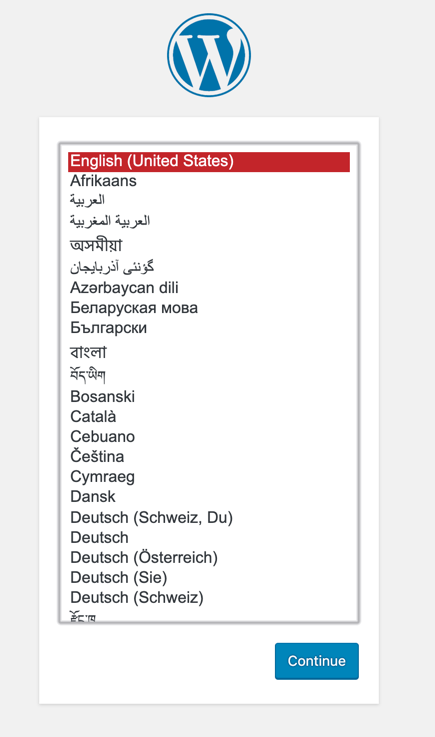
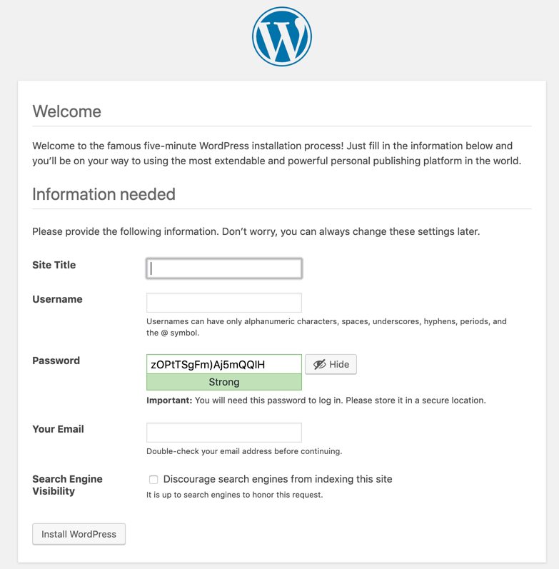
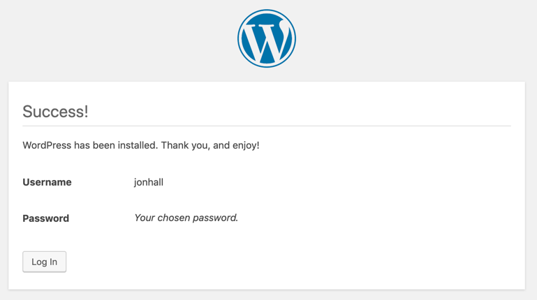

## Purpose

This section provides the steps to modify the Ansible Playbooks to configure the application software previously installed on the VSIs.  

### Prerequisites

1. Infrastructure has been successfully provisioned using the Terraform plan in the previous steps and all post provisioning installation is complete and the 
terraform.tfstate file created by Terraform is accessible by Ansible dynamic inventory script

2. A site-to-site VPN connection established two the two Availability Zones where the VSI's exist.
    - Connectivity from the Ansible Controller over the vpn connection to VSI's
    - The private key installed on the Ansible Controller which matches the public key which was deployed to the VSIs during provisioning


## Steps to modify sample Ansible Plan

1. [Download and install Ansible for your system](https://docs.ansible.com/ansible/latest/installation_guide/intro_installation.html). 


2. Modify the directory path of the terrafrom.tfstate in the [terraform_inv.ini](../ansible-playbooks/inventory/terraform_inv.ini) to match the system
location.   The state infromation will be used to build a dynamic inventory when executing the Ansible playbook.
 
    ```sh
    [TFSTATE]
    TFSTATE_FILE = /terraform_plan_directory/terraform.tfstate
    ```

3.  Rename [all-sample.yaml](../ansible-playbooks/inventory/group_vars/all-sample.yaml) to `all.yaml` and modify dbpassword, logdna_key, and sysdig_key

    ```sh
    dbpassword: securepassw0rd
    logdna_key: logdna key goes here
    sysdig_key: sysdig key goes here
    ```

4. Test the dynamic inventory script using the --list-hosts options.  The output should show the hosts, and groups which have
been dynamically created from the inventory script based on the Terraform state file.

    ```sh
    cd ansible-playbooks
    ansible-playbook -i inventory site.yaml --list-hosts
    ```
    Output:
    ```sh
      playbook: site.yaml
    
      play #1 (all): Apply common configuration to all nodes in inventory   TAGS: []
        pattern: ['all']
        hosts (4):
          webapp01-us-south-1
          mysql01-us-south-2
          webapp01-us-south-2
          mysql01-us-south-1
    
      play #2 (webapptier): Configure and deploy the web and application code to webapptier TAGS: []
        pattern: ['webapptier']
        hosts (2):
          webapp01-us-south-1
          webapp01-us-south-2
    
      play #3 (dbtier): Configure Mysql Servers in dbtier   TAGS: []
        pattern: ['dbtier']
        hosts (2):
          mysql01-us-south-2
          mysql01-us-south-1
     ```

5.  The Ansible playbook is divided into three plays: `common`, `web` and `db`.   The `common` play will be applied to all VSIs.  The web
play will be applied to only the VSIs in the `webapptier` security group, and the DB play will be applied to only the hosts in the `dbtier`
security group.  To verify the tasks which will be applied in each play execute the following command.

    ```shell
    ansible-playbook -i inventory site.yaml --list-tasks
    ```
    
    Output:
    ```shell

      playbook: site.yaml

      play #1 (all): Apply common configuration to all nodes in inventory   TAGS: []
        tasks:
          common : Add LogDNA repo and install      TAGS: []
          common : Configure LogDNA TAGS: []
          common : Set LogDNA to autostart  TAGS: []
    
      play #2 (webapptier): Configure and deploy the web and application code to webapptier TAGS: []
        tasks:
          web : Create Wordpress Directory  TAGS: []
          web : Download and untar Wordpress distro TAGS: []
          web : Copy wp-config.php to server        TAGS: []
          web : Copy wordpress.config to server     TAGS: []
          web : Copy db-config      TAGS: []
          web : Copy db-php TAGS: []
          web : Modify wp-config for master db      TAGS: []
          web : Add slave_db_host to wp-config      TAGS: []
          web : Set database password in wp-config  TAGS: []
          web : Set wordpress file permissions      TAGS: []
          web : Add LogDNA tag for webapp   TAGS: []
          web : restart LogDNA      TAGS: []
          web : Install & Configure sysdig on Webapp server TAGS: []
          web : Update Nginx Unit Config    TAGS: []
          web : Configure NGINX and NGINX Unit to auto start and reload     TAGS: []
          web : Copy nginx default.conf to server   TAGS: []
          web : Add ip as nginx server_name to default.conf TAGS: []
          web : update nginx with wordpress config  TAGS: []
          web : Restart nginx server        TAGS: []
    
      play #3 (dbtier): Configure Mysql Servers in dbtier   TAGS: []
        tasks:
          db : Change mysqld.cnf to listen on all interfaces        TAGS: []
          db : Create wordpress database on the server      TAGS: []
          db : Create wordpress user        TAGS: []
          db : Add logDNA tag       TAGS: []
          db : restart LogDNA       TAGS: []
          db : Install & Configure sysdig on DB server      TAGS: []
          db : Add replication settings to server-id my.cnf for master      TAGS: []
          db : Add replication settings to log_bin my.cnf for master        TAGS: []
          db : Add replication settings to binlog_do_db my.cnf for master   TAGS: []
          db : Add sql_mode TAGS: []
          db : Create slave user    TAGS: []
          db : restart mysql        TAGS: []
          db : Add replication settings to server-id my.cnf for slave       TAGS: []
          db : Add replication settings to relay-log my.cnf for master      TAGS: []
          db : Add replication settings to log_bin my.cnf for master        TAGS: []
          db : Add replication settings to binlog_do_db my.cnf for master   TAGS: []
          db : Add sql_mode TAGS: []
          db : restart mysql        TAGS: []
          db : Create slave user    TAGS: []
          db : Stop Slave   TAGS: []
          db : Configure Slave Replication  TAGS: []
          db : Start Slave  TAGS: []

    ```

    
6. Before executing the plays, verify that the post provisioning processes which update and install the required packages are complete,
connectivity is established over the VPN and the servers are ready to be configured by SSHing into each server and issuing the following command 
to verify the cloud-init status is done. 
    
    ```shell
    cloud-init status    
    ```

    Output:
    ```shell
    
     Welcome to Ubuntu 16.04.6 LTS (GNU/Linux 4.4.0-150-generic x86_64)
    
     * Documentation:  https://help.ubuntu.com
     * Management:     https://landscape.canonical.com
     * Support:        https://ubuntu.com/advantage
    
      Get cloud support with Ubuntu Advantage Cloud Guest:
        http://www.ubuntu.com/business/services/cloud
    
    0 packages can be updated.
    0 updates are security updates.
    
    The programs included with the Ubuntu system are free software;
    the exact distribution terms for each program are described in the
    individual files in /usr/share/doc/*/copyright.
    
    Ubuntu comes with ABSOLUTELY NO WARRANTY, to the extent permitted by
    applicable law.
    
    root@mysql01-us-south-1:~# cloud-init status
    status: done

    
    ```

7. Now that you have verified the inventory, the plays, and that connectivity exists and the post-provisioning is complete
issue the following command from the controller workstation where you installed Ansible.
    
    ```shell
    ansible-playbook -i inventory site.yaml
    ```
   
8. Once the playbook is complete, open a browser and enter the URL you specified in the Terraform variables.tf file for Wordpress.  Remember, for this example we did not configure SSL so prefix the host
and domain with `http://`.   This URL was also displayed upon the completion of the Terraform play.  This URL resolves to the Cloud Internet Services (CIS) DDOS
proxy / Global Load Balancer configured by Terraform, and is then directed to the VPC Load Balancer service which directs to the request to an available
Web/Application server.  This step is neccessary to initialize the wordpress database and begin your customization of Wordpress which will be replicated to the
slave database.

    a. Browse to URL and select the desired language
    
     
    
    b. Give your site a name, and select your user name and password.  Click Install Wordpress.
    
    
    
    c. Click Login In and enter your username and password.
    
    
    
    d. Your done.  Customize your site.
    
    
    